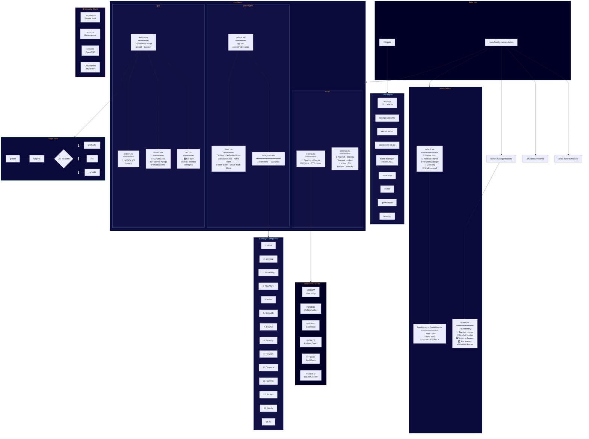

# Steelbore Lattice — Architecture Diagram



---

## Data Flow Summary

```
┌─────────────────────────────────────────────────────────────────┐
│                        flake.nix                                │
│  ┌──────────────┐  ┌──────────────┐  ┌──────────────────────┐  │
│  │   nixpkgs     │  │  unstable    │  │  External Flakes     │  │
│  │   (25.11)     │  │  (bleeding)  │  │  cosmic · lanzaboote │  │
│  │              │  │              │  │  emacs-ng · rivetui  │  │
│  │   ~100 pkgs  │  │   ~8 pkgs   │  │  goldwarden · twarden│  │
│  └──────┬───────┘  └──────┬───────┘  └──────────┬───────────┘  │
│         │                 │                     │              │
│         └─────────────────┼─────────────────────┘              │
│                           ▼                                    │
│              nixosConfigurations.lattice                        │
└───────────────────────────┬─────────────────────────────────────┘
                            │
              ┌─────────────┼──────────────┐
              ▼             ▼              ▼
     ┌────────────┐  ┌───────────┐  ┌───────────┐
     │   hosts/   │  │ modules/  │  │  home-    │
     │  lattice   │  │           │  │  manager  │
     │            │  │           │  │           │
     │ • Boot     │  │ packages/ │  │ • Git     │
     │ • Kernel   │  │ • 14 cats │  │ • Shell   │
     │ • User     │  │ • fonts   │  │ • Terms   │
     │ • Network  │  │           │  │ • WM dots │
     │ • Hardware │  │ gui/      │  │ • Bar     │
     │            │  │ • COSMIC  │  └───────────┘
     └────────────┘  │ • Niri    │
                     │ • LeftWM  │
                     │ • greetd  │
                     │           │
                     │ core/     │
                     │ • theme   │
                     │ • settings│
                     └───────────┘
```
